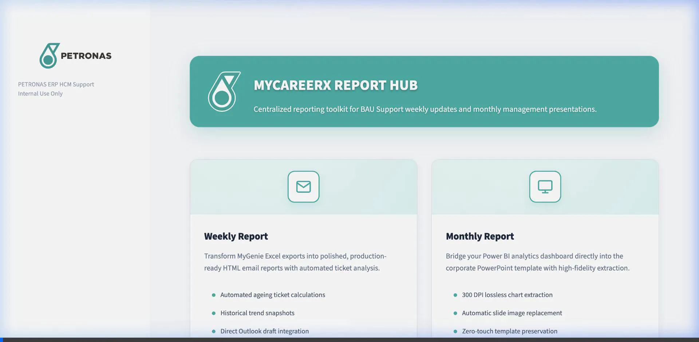
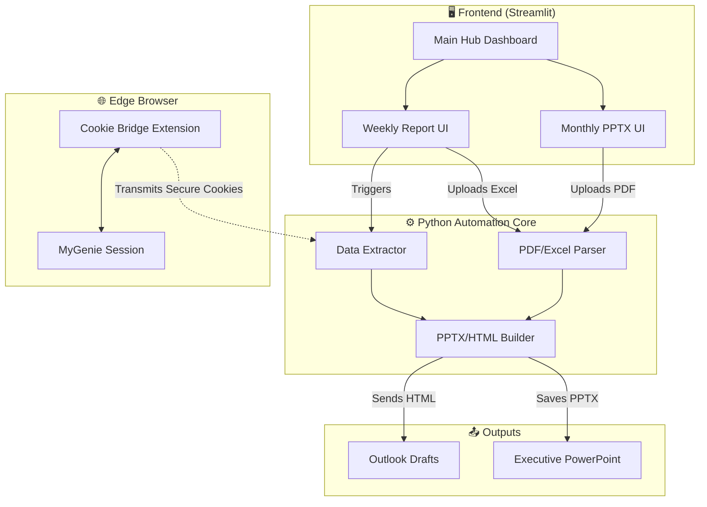

<div align="center">
  
  <h1>PETRONAS Report Automation Hub</h1>
  <p>An enterprise-grade Python application for automating ITSM Weekly Reports and PowerPoint Generation</p>

  
  
  
  
</div>

<br />

## 🚀 Overview
The **PETRONAS Report Automation Hub** is a robust, end-to-end automation suite designed to completely eliminate manual reporting overhead. By seamlessly integrating with Microsoft Edge session cookies and manipulating raw Excel and Power BI data, this application acts as a central control plane for generation, visualization, and distribution of ITSM data.

<div align="center">
  <h3>🎬 Live System Demo</h3>
  
</div>

<br />

## ✨ Key Features

### 1. 📊 Weekly SR & Incident Report Automation
*   **Live Edge Cookie Extraction**: Securely fetches live active session tokens directly from your browser to pull real-time ticket counts via the BMC Helix API.
*   **Excel Data Aggregation**: Ingests raw SR, WO, and INC datasets.
*   **Outlook Integration**: Formats the cleaned data into a flawless, corporate-branded HTML email and automatically drafts it in Outlook.

### 2. 📈 Monthly PowerPoint PPTX Automation
*   **Power BI PDF Scraping**: Uses `PyMuPDF` to programmatically extract vector-perfect charts and matrices from monthly Power BI Dashboard PDF exports.
*   **Intelligent Layout Engine**: Uses `python-pptx` to deterministically crop, scale, and inject the scraped data exactly into corporate presentation templates.
*   **Executive Summary Generation**: Automatically generates chronological comparison bullet points based on trend differences between the current and previous month.

---

## 🏗️ System Architecture

The application is built on a modern Python stack featuring **Streamlit** for a reactive, professional UI, and a custom **Browser Cookie Bridge** to bypass strict corporate CSP and firewall regulations.



---

## 💻 Installation & Setup

### For Developers (Running via Source)
Ensure you have Python 3.10+ installed.

```bash
# 1. Clone the repository
git clone https://github.com/izwanGit/petronas-report-automation.git
cd petronas-report-automation

# 2. Set up virtual environment
python -m venv venv
source venv/bin/activate  # On Windows: venv\Scripts\activate

# 3. Install dependencies
pip install -r requirements.txt

# 4. Launch the application
python run_app.py
```

### For Corporate Users (Running via .exe)
1. Extract the `PETRONAS Report Hub` ZIP file provided by the developer.
2. Double-click **`PETRONAS Report Hub.exe`**.
3. A terminal will briefly flash, and the beautiful Streamlit application will open in your default browser. No coding or Python installation required!

---

## 🔌 Edge Browser Extension Setup
Due to high-level corporate security policies preventing background executables from hijacking browser tokens, **the MyGenie Cookie Bridge extension must be installed manually once.**

1. Open Microsoft Edge and navigate to `edge://extensions`.
2. Toggle on **Developer Mode** in the bottom left corner.
3. Click **Load Unpacked**.
4. Select the `cookie_bridge_extension` folder located inside `MyGenie_Cookie_Bridge/`.
5. You're done! Simply click the extension icon in your toolbar to securely sync your live session data into the Python application.

---

## 🛡️ Corporate Branding
This tool strictly enforces PETRONAS branding guidelines:
*   **Primary Color:** PETRONAS Teal (`#00B1A9`)
*   **Dark Accent:** Deep Forest (`#008C86`)
*   **Typography:** Professional sans-serif styling with strict "No Emoji" policies in the main reporting interfaces to ensure a sleek, executive appearance.

<br />

<div align="center">
  <i>Developed for PETRONAS IT Operations & Service Management</i>
</div>
